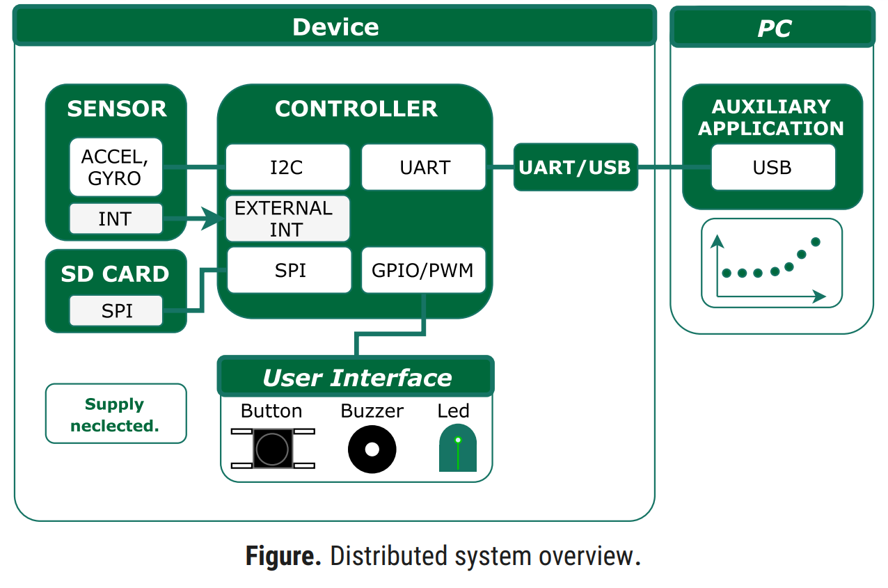
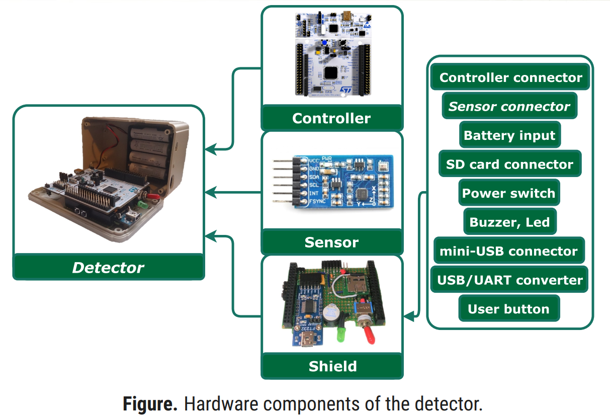
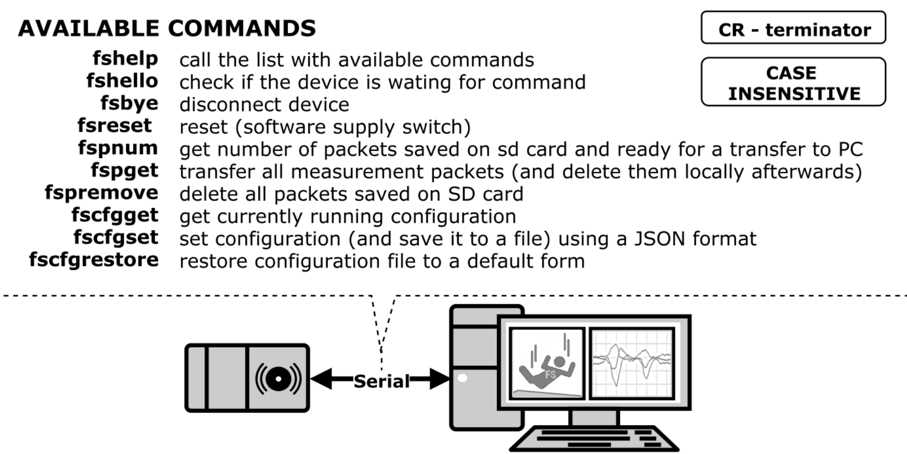
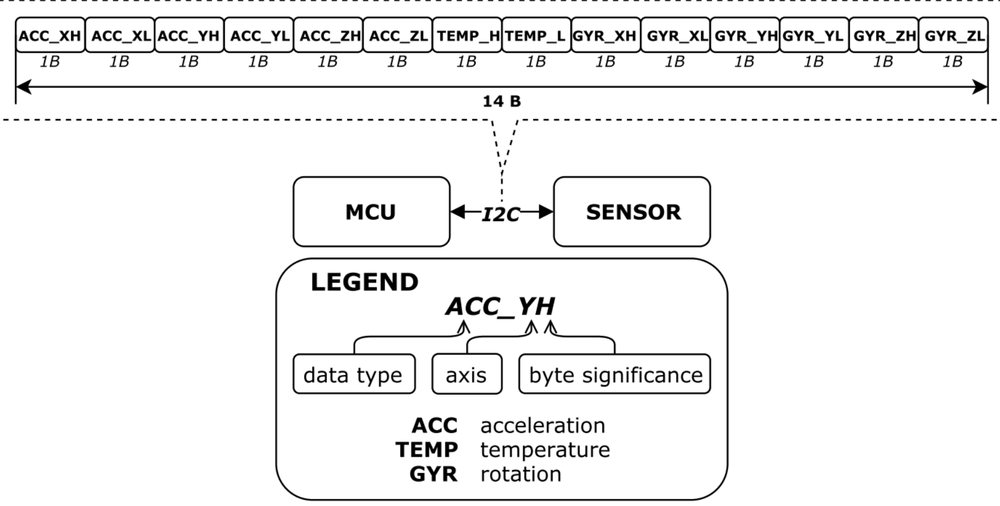
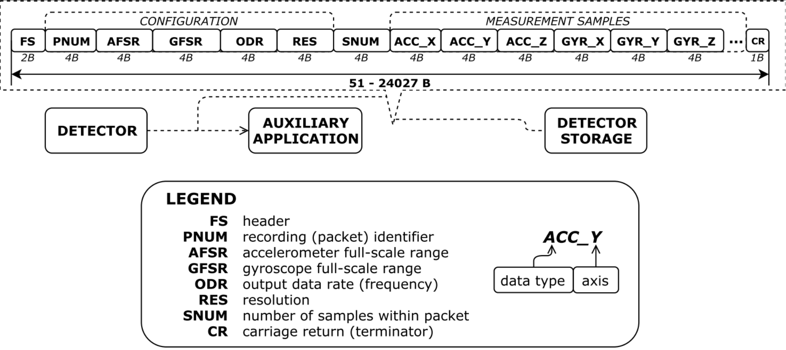
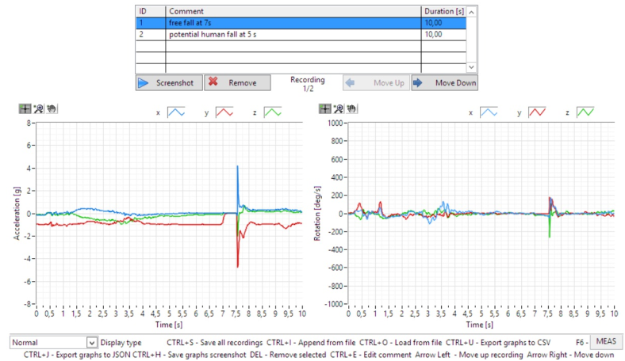

# Fall Sensor
###### [Presentation](docs/Presentation.pdf) | [Hardware Schematic](docs/HW-schematic.pdf) | [User Manual](docs/Manual.pdf) | [Sprint Summary](docs/Sprints.pdf)

Embedded prototype of fall detection system based on incremental development model and motion data analysis app.

> *The project constitutes the appendix to my Engineering Thesis written for AGH University of Science and Technology in academic year 2017/18.*

**Abstract**

- whole project based on incremental development model with one-week sprints
- several releases from which any could play a role of MVP
- provided hardware and software prototype

**Development steps**

1. Build distributed measurement system for collecting data from
    the sensor and process it using PC.
2. Perform ADL (activity daily living) scenario and simulate
    accidents.
3. Implement fall detection algorithm.
4. Add emergency system.

### System overview



## Requirements

### Software

- [ARM mbed](https://os.mbed.com/users/mbed_official/code/mbed/) SDK (release 150) and online IDE
- [LabVIEW 2016](http://www.ni.com/download/labview-development-system-2016/6055/en/)

### Hardware

- [NUCLEO-L476RG](https://www.st.com/en/evaluation-tools/nucleo-l476rg.html), *ST Microelectronics*
- [10 DoF IMU Sensor](https://www.waveshare.com/wiki/10_DOF_IMU_Sensor_(C)), *Waveshare*
- USB-UART converter
- microSD card slot
- buzzer, LED, button
- passive elements
- 4x AA batteries or other supply



## How to use

### Developer

1. Prepare a prototype, based on [schematic](docs/HW-schematic.pdf).
2. Import [project](mcu) to online [compiler](https://ide.mbed.com/compiler). You have to do it manually - sorry!
3. Import [SDFileSystem](https://os.mbed.com/users/mbed_official/code/SDFileSystem/) as well as [mbed](https://os.mbed.com/users/mbed_official/code/mbed/) (watch out - some newer versions could be incompatible).
4. Make sure the [pinout](mcu/pinout.h) meet your expectations.
5. Program the device.

### End User

The device works in two modes:

- fall detection
- data acquisition

To make use of its features go through the [User Manual](docs/Manual.pdf), section: *A.2. How to use*.

## Communication

###### Serial

There are couple of [commands](mcu/command_decoder/command_decoder.cpp#L13) for serial communication available:



### Packet frames

Two links can be distinguished.

**MCU-SENSOR**

###### Medium: *I2c* |  Payload: 14 B |  Acceleration, rotation 3-axis 16b and 16b temperature



**SENSOR-DATA ANALYSIS APP, SENSOR-STORAGE**

###### Medium: *UART/SPI* |  Payload: 51-24027 B |  Configuration, measurement samples




## Configuration

Device has an ability to be configured with parameters shown below.

```json
{
  "SensorConfiguration": {
    "AccelDLPFFrequency": "5HZ",
    "AccelFSRange": "8G",
    "Frequency": "100HZ",
    "GyroDLPFFrequency": "5HZ",
    "GyroFSRange": "1000DPS",
    "InterruptMode": "DATA_RDY",
    "InterruptPinMode": "OPEN_DRAIN_FALLING_EDGE",
    "Resolution": 16
  }
}
```

The configuration file is stored in the external memory. Can be changed via:

- serial port (as described earlier)
- data analysis app

## Readouts

Are stored as raw packets in external memory and sent via serial port on demand. For acquisition, circular buffer has been implemented. 10-second buffer for data is applied.

### Fall detection

###### [Block diagram](media/fall_detection_diagram.pdf)

Always 5 s before and 5 s after event are available thanks to double-buffering.

### Data acquisition

###### [Block diagram](media/motion_recording_diagram.pdf)

Up to 150 000 can theoretically be saved in 4 GB external flash. Note that a data transfer between device and PC isn't efficient enough for sensible transfer of such a big amount of data.

## Motion data analysis

###### [Responsibilities](media/auxiliary_application_responsibilities.pdf) | File extension: **.fsdat*

Can be made with the app mentioned earlier. User interface is simple but readable. Features:

- browse and comment readouts
- configure device
- export data to *CSV/JSON*
- change graph display mode

**Registered fall** (in data acquisition mode)


